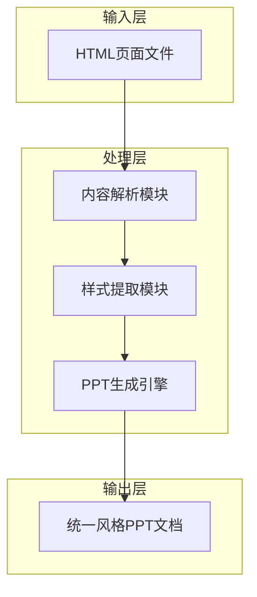

# PPT生成技术架构方案

## 1. 架构设计



## 2. 技术描述

* 前端：HTML5 + CSS3 + JavaScript

* 样式框架：Tailwind CSS + Font Awesome

* PPT生成：Python + python-pptx库

* 内容解析：BeautifulSoup4 + lxml

## 3. 实现方案

### 3.1 内容提取策略

| 提取目标 | 技术方案   | 实现方式               |
| ---- | ------ | ------------------ |
| 页面标题 | HTML解析 | 提取title标签和h1标签内容   |
| 正文内容 | DOM遍历  | 解析p、li、div等文本容器    |
| 图标信息 | CSS类解析 | 提取Font Awesome图标类名 |
| 样式信息 | CSS解析  | 提取颜色、字体、布局信息       |

### 3.2 样式统一方案

**配色方案**：

* 主色：蓝色(#3b82f6) 和 绿色(#10b981)

* 背景：浅灰(#f5f5f5)

* 文字：深灰(#1f2937)

* 卡片：白色(#ffffff)

**字体方案**：

* 中文：Noto Sans SC

* 英文：Arial, sans-serif

* 标题：粗体(700)

* 正文：常规(400)

**布局方案**：

* 页面尺寸：16:9 (1280x720)

* 边距：统一24px

* 卡片圆角：8-12px

* 阴影效果：0 4px 15px rgba(0,0,0,0.1)

### 3.3 PPT模板设计

**母版设计**：

* 背景：渐变色 + 几何装饰元素

* 页眉：公司Logo + 项目标题

* 页脚：页码 + 版权信息

**内容页模板**：

1. **封面模板**：大标题 + 副标题 + 装饰元素
2. **目录模板**：多栏布局 + 图标导航
3. **内容模板**：标题 + 正文 + 要点列表
4. **图表模板**：数据可视化 + 说明文字
5. **联系模板**：联系信息卡片 + 装饰背景

## 4. 实施步骤

### 4.1 第一阶段：内容解析

1. 遍历30个HTML文件
2. 提取页面标题和正文内容
3. 识别页面类型和结构
4. 保存为结构化数据

### 4.2 第二阶段：样式提取

1. 分析CSS样式规则
2. 提取配色方案
3. 识别字体和布局信息
4. 生成样式配置文件

### 4.3 第三阶段：PPT生成

1. 创建PPT母版和模板
2. 根据页面类型选择合适模板
3. 填充内容和应用样式
4. 生成最终PPT文档

## 5. 核心代码结构

```python
# 主要模块结构
class PPTGenerator:
    def __init__(self):
        self.html_parser = HTMLParser()
        self.style_extractor = StyleExtractor()
        self.ppt_builder = PPTBuilder()
    
    def generate_ppt(self, html_folder_path):
        # 解析HTML文件
        pages_data = self.html_parser.parse_folder(html_folder_path)
        
        # 提取样式信息
        style_config = self.style_extractor.extract_styles(pages_data)
        
        # 生成PPT
        ppt_file = self.ppt_builder.create_presentation(pages_data, style_config)
        
        return ppt_file
```

## 6. 质量保证

### 6.1 样式一致性检查

* 颜色使用规范检查

* 字体大小层次检查

* 布局对齐检查

* 间距统一性检查

### 6.2 内容完整性验证

* 页面数量验证(30页)

* 关键信息提取验证

* 图标和装饰元素验证

* 页码和导航验证

### 6.3 输出格式优化

* PPT文件大小优化

* 字体嵌入处理

* 图片质量优化

* 兼容性测试

## 7. 预期成果

**输出文件**：四川能投智慧光电智慧产业生态合作方案.pptx

**文件特点**：

* 30页完整内容

* 统一的视觉风格

* 专业的商务演示效果

* 高质量的排版和设计

* 便于编辑和修改

