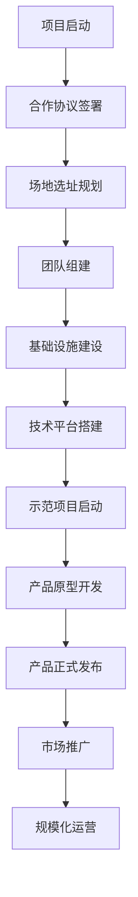

# 四川能投智慧光电有限公司智慧产业生态合作方案

## 1. 产品概述

本方案是四川能投智慧光电有限公司与电子科技大学科技园人工智能概念验证中心的深度合作方案，旨在构建智慧产业生态，打造高品质科创空间，推动智慧工地创新发展。

* 核心目标：融合能源与算力，通过产学研深度合作，共创数字经济新未来

* 市场价值：抢抓数字经济发展机遇，在智慧建筑和园区智能化转型中占据领先地位

## 2. 核心功能

### 2.1 用户角色

| 角色       | 参与方式  | 核心权限             |
| -------- | ----- | ---------------- |
| 四川能投智慧光电 | 合作主导方 | 提供资源投入、场地支持、市场推广 |
| 电子科大科技园  | 技术支持方 | 提供技术研发、人才培养、概念验证 |
| 入驻企业     | 生态参与方 | 享受孵化服务、技术支持、市场对接 |

### 2.2 功能模块

本合作方案包含以下主要功能模块：

1. **封面页面**：项目标题、合作方信息、报告日期
2. **目录页面**：完整的内容结构导航
3. **合作背景**：数字经济发展机遇、政策导向、行业趋势分析
4. **合作主体**：双方机构介绍和核心优势
5. **合作内容**：智慧产业生态构建、科创空间运营、智慧工地系统
6. **合作模式**：职责分工、运营策略、收益分配
7. **价值展望**：短期商业价值、长期战略价值、未来发展规划
8. **实施计划**：时间表、里程碑、关键节点
9. **联系信息**：双方联系方式和后续沟通渠道

### 2.3 页面详情

| 页面名称 | 模块名称 | 功能描述                       |
| ---- | ---- | -------------------------- |
| 封面页  | 标题展示 | 显示项目名称、合作方、日期，采用渐变背景和现代化设计 |
| 目录页  | 内容导航 | 提供完整的章节结构，包含6个主要部分和详细子项目   |
| 合作背景 | 机遇分析 | 展示数字经济发展、智慧城市建设、建筑智能化三大机遇  |
| 合作主体 | 机构介绍 | 详细介绍四川能投智慧光电和电子科大的优势与资源    |
| 合作内容 | 项目规划 | 包含智慧产业生态、科创空间、智慧工地三大核心内容   |
| 合作模式 | 运营策略 | 明确职责分工、沟通机制、收益分配和政策支持      |
| 价值展望 | 效益分析 | 分析短期商业价值、平台功能价值和长期战略价值     |
| 实施计划 | 时间安排 | 制定24个月实施周期，分3个阶段12个关键里程碑   |
| 联系信息 | 沟通渠道 | 提供双方详细联系方式，便于后续合作对接        |

## 3. 核心流程

### 主要业务流程

1. **项目启动流程**：签署合作协议 → 场地选址规划 → 团队组建 → 基础设施建设
2. **平台建设流程**：技术平台搭建 → 示范项目启动 → 产品原型开发 → 系统测试验证
3. **市场推广流程**：产品正式发布 → 客户开发签约 → 规模化推广 → 盈亏平衡实现

## 4. 用户界面设计

### 4.1 设计风格

* **主色调**：蓝色系(#3b82f6)和绿色系(#10b981)的渐变组合

* **辅助色**：灰色系(#f5f5f5背景)、白色(#ffffff卡片)

* **按钮样式**：圆角设计，渐变背景，悬停效果

* **字体**：Noto Sans SC，支持中文显示，层次分明

* **布局风格**：现代化网格布局，卡片式设计，响应式适配

* **图标风格**：Font Awesome图标库，线性和填充图标结合

### 4.2 页面设计概览

| 页面名称 | 模块名称  | UI元素                  |
| ---- | ----- | --------------------- |
| 封面页  | 主标题区域 | 大号字体、渐变文字效果、装饰性几何图形背景 |
| 目录页  | 章节导航  | 彩色图标、悬停动效、分栏布局、进度指示   |
| 内容页  | 信息展示  | 卡片式布局、图标配色、渐变边框、阴影效果  |
| 数据页  | 统计图表  | 数字展示、进度条、饼图、时间轴设计     |
| 联系页  | 信息卡片  | 联系方式卡片、渐变背景、图标标识      |

### 4.3 响应式设计

* **桌面优先**：主要针对1280x720分辨率设计

* **移动适配**：支持平板和手机端浏览

* **交互优化**：支持触摸操作和鼠标悬停效果

## 5. 技术实现

### 5.1 前端技术

* HTML5 + CSS3 + JavaScript

* Tailwind CSS框架

* Font Awesome图标库

* Google Fonts字体服务

### 5.2 设计特色

* 渐变背景和几何装饰元素

* 网格线背景纹理

* 卡片式信息展示

* 动态悬停效果

* 统一的配色方案

### 5.3 内容结构

* 30个独立页面

* 完整的业务逻辑链条

* 专业的商务演示风格

* 中英文混合排版支持

